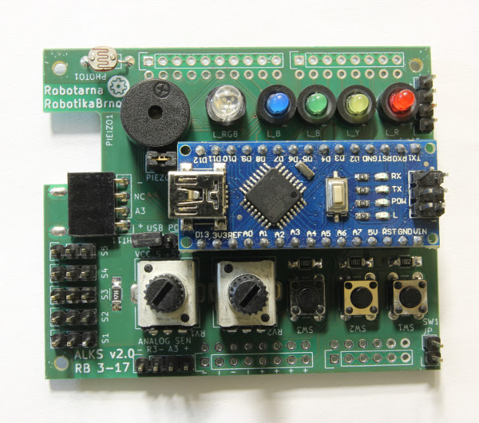
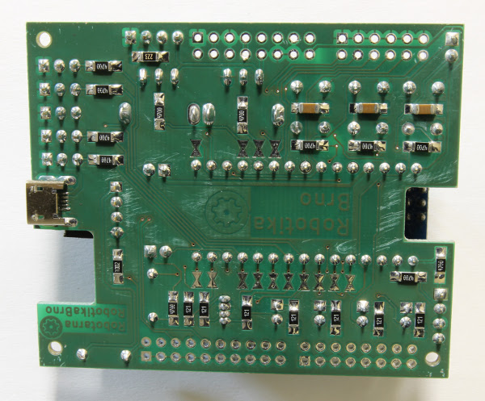

# ArduinoLarningKitStarter

[English version follows]

Výukový kit pro Arduino Nano a Uno určeným začátečníkům od
[RobotikaBrno.cz](http://robotikabrno.cz/). Cílem projektu je usnadnit úplným
začátečníkům jejich první krůčky s Arduinem a vyhnout se "bastlení vrabčího
hnízda". Náš kit si klade za cíl odstranit typické nedostatky vývojových desek
pro Arduina - jako např. malý počet nápájecích pinů pro periférie. Veškeré
komponenty jsou ve velkých pouzdrech, což umožňuje desku osadit i začátečníkům.

Deska obsahuje:

- 4 LED
- RGB LED
- 3 tlačítka
- 2 potenciometry
- 5 konektorů pro připojení modelářského serva (s posíleným napájením přes
  microUSB konektroq)
- port pro připojení vlhkoměrného čidla DHT11
- port pro připojení sériové linky
- odpojitelné blockovací kondenzátory u tlačítek pro demonstraci zákmitů
- fotorezistor
- dostatečný počet napájecích pinů

Náš kit také funguje jako redukce Arduino Nano-Uno a umožňuje tak připojit k
Arduinu Nano shieldy určené pro Arduino Uno. V případě že by nějaká komponenta
kitu znemožňovala funkci shieldu, je možné ji přes pájecí můstek odpojit.

Jak s naším kitem začít? Postupuj podle [Wiki stránky](https://github.com/RoboticsBrno/ArduinoLearningKitStarter/wiki).

## English Version

Learning kit for Arduino Nano and Uno for complete beginners by
[RobotikaBrno.cz](http://robotikabrno.cz/). This kit tries ease the first steps
with Arduino programming and tries to prevent a "wire mess". It also tries to
eliminate usual imperfections of Arduino-like boards - e.g. the lack of
sufficient number of power supply pins for your peripherals. All the components
are in large packages and therefore, even a beginner can populate this board.

The board contains:

- 4 LEDs
- RGB LED
- 3 buttons
- 2 potentiometers
- 5 connectors for RC servo (with external power supply)
- port for humidity sensor DHT11
- port for serial line
- detachable debouncing capacitors for a button to demonstrate this phenomenon
- photo resistor
- sufficient number of power pins

The kit can be also used as a converter for Arduino Nano-Uno and therefore,
shields originally intended for Arduino Uno can be also used with Arduino Nano.
If there is pin collision between shield and a kit component, the component can
be disconnected using a solder bridge.

Getting started - unfortunately, we provide currently only a Czech tutorial on
our [Wiki page](https://github.com/RoboticsBrno/ArduinoLearningKitStarter/wiki).
